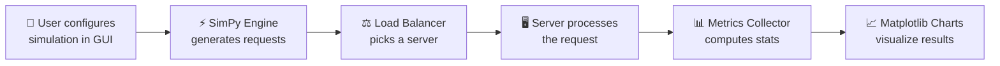

# How to Explain This Project to Your Teacher

## 1. One-Line Summary

> "We built a **Python simulation** that generates fake web traffic, distributes it across servers using **3 different load balancing algorithms**, measures performance metrics like **response time, throughput, and server utilization**, and displays the comparison through an **interactive GUI with charts**."

---

## 2. The Big Picture (Architecture)



Tell your teacher:
> "The system follows a **pipeline**: User sets config → Requests are generated → Load balancer assigns each request to a server → Server processes it → We collect metrics → We display charts comparing algorithms."

---

## 3. Step-by-Step Code Flow

### Step 1: User Clicks "Run Simulation"

File: [config_panel.py](file:///d:/Load Balancer/gui/config_panel.py)

> "The GUI collects all settings — number of servers, number of requests, arrival rate, service rate, which algorithms to compare, and server weights. It packs this into a config dictionary and passes it to the simulation runner."

### Step 2: Request Generation (Poisson Process)

File: [engine.py](file:///d:/Load Balancer/simulation/engine.py) — `_generate_requests()` method

```python
# Exponential inter-arrival time = Poisson process
inter_arrival = np.random.exponential(1.0 / self.arrival_rate)
yield self.env.timeout(inter_arrival)

# Service time also follows exponential distribution
service_time = np.random.exponential(1.0 / self.service_rate)
```

> "We use **SimPy** (a discrete-event simulation library) to model time. Requests arrive following a **Poisson process** — the gaps between arrivals follow an **exponential distribution**. This is how real web traffic behaves. Each request also gets a random service time (how long it takes to process)."

### Step 3: Load Balancer Selects a Server

File: [load_balancer.py](file:///d:/Load Balancer/simulation/load_balancer.py)

**Round Robin** — simplest algorithm:
```python
def _round_robin(self):
    server = self.servers[self._rr_index % len(self.servers)]
    self._rr_index += 1
    return server
```
> "Goes through servers in order: Server 0 → 1 → 2 → 0 → 1 → 2... Like dealing cards."

**Least Connections** — smartest for even load:
```python
def _least_connections(self):
    return min(self.servers, key=lambda s: (s.active_connections, s.id))
```
> "Picks whichever server currently has the **fewest requests being processed**. This adapts to real-time load."

**Weighted Round Robin** — for heterogeneous servers:
```python
def _weighted_round_robin(self):
    # Uses GCD-optimized algorithm to distribute proportionally
    # Server with weight=5 gets 5x more requests than weight=1
```
> "Like Round Robin, but servers with higher weights get **proportionally more requests**. Useful when some servers are more powerful than others."

### Step 4: Server Processes the Request

File: [engine.py](file:///d:/Load Balancer/simulation/engine.py) — `_process_request()` method

```python
with server.resource.request() as req:
    yield req                                    # Wait in queue if server busy
    request.start_time = self.env.now            # Record when processing starts
    yield self.env.timeout(request.service_time) # Simulate processing time
    request.end_time = self.env.now              # Record completion
```

> "Each server is modeled as a **SimPy Resource** with limited capacity. If all slots are busy, the request **waits in a queue**. This is how real servers work — they can only handle a fixed number of concurrent connections."

### Step 5: Metrics Collection

File: [collector.py](file:///d:/Load Balancer/metrics/collector.py)

| Metric | Formula | What It Tells Us |
|--------|---------|-----------------|
| **Response Time** | `end_time - arrival_time` | How long users wait |
| **Throughput** | `total_requests / simulation_time` | How many requests/sec the system handles |
| **Server Utilization** | `busy_time / (total_time × capacity) × 100` | How busy each server is (%) |
| **Load Efficiency** | `(1 - coefficient_of_variation) × 100` | How evenly load is spread |

> "After simulation, we compute **4 key metrics**. Response time includes both queue wait + processing time. Utilization tells us if servers are overloaded or idle. Load efficiency measures how **evenly** requests were distributed."

### Step 6: Visualization

File: [charts.py](file:///d:/Load Balancer/visualization/charts.py)

> "We generate **5 types of charts** using Matplotlib, embedded directly into the Tkinter GUI:
> 1. Response Time Comparison (grouped bars)
> 2. Throughput Comparison
> 3. Per-Server Utilization
> 4. Load Distribution (requests per server)
> 5. Response Time Histogram (distribution shape)"

---

## 4. Key Technical Concepts to Mention

### Why SimPy?
> "SimPy is a **discrete-event simulation** library. Instead of running real servers, we simulate time jumps — the simulation only advances when an event happens (request arrives, request finishes). This lets us simulate **thousands of requests in milliseconds**."

### Why Poisson Process?
> "Real web traffic follows a Poisson distribution — requests arrive randomly and independently. The exponential inter-arrival time is the standard model used in **queuing theory** (M/M/1 and M/M/c queues)."

### Why Threading?
> "The simulation runs in a **background thread** so the GUI stays responsive. Without threading, the window would freeze during simulation."

---

## 5. Expected Results to Highlight

| Algorithm | Best For | Trade-off |
|-----------|----------|-----------|
| **Round Robin** | Even distribution when all servers are equal | Doesn't adapt to varying server load |
| **Least Connections** | Lowest response time under varying loads | Slightly more overhead to track connections |
| **Weighted Round Robin** | Heterogeneous server environments | Requires knowing server capacities in advance |

> "In our testing:
> - **Round Robin** had the **best load efficiency** (98.6%) because it distributes evenly
> - **Least Connections** had the **lowest response time** because it avoids overloaded servers  
> - **Weighted Round Robin** had the **highest throughput** because it sends more traffic to powerful servers"

---

## 6. If Teacher Asks Tough Questions

**Q: "Why not use real servers?"**
> "Simulation lets us **control variables** precisely — same request pattern for all algorithms. With real servers, network jitter and OS scheduling would add noise."

**Q: "How is this different from just random assignment?"**
> "Random would have high variance. Round Robin guarantees equal distribution. Least Connections adapts dynamically. We can show the difference in the load distribution chart."

**Q: "What's the coefficient of variation?"**
> "It's `standard_deviation / mean`. If all servers got exactly the same number of requests, CV = 0, efficiency = 100%. Higher CV means more uneven distribution."

**Q: "Can this scale to real workloads?"**
> "The simulation handles up to 5000 requests easily. For real-world deployment, the same algorithms would be implemented in a reverse proxy like Nginx or HAProxy."
